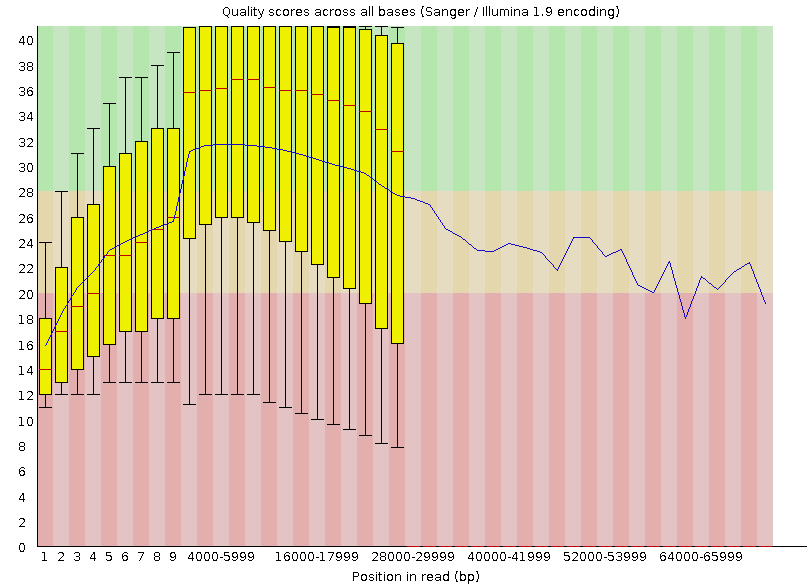
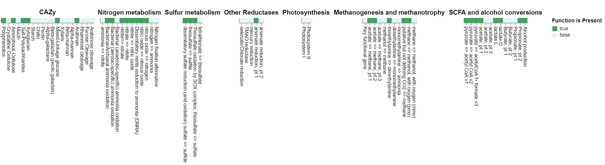
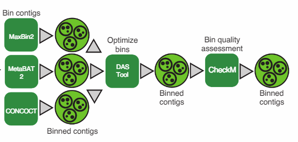

## Soil Metagenomics for ONT Sequencing

**This repository was copied (with permission)from the original USDA-ARS repository I created. This repository is only intended to demostrate my coding ability**

### Overview

The respository is setup with each numbered folder refers to a major analysis step (i.e. 00_raw_data). The folder burgess_notebook details my notes of the development process for all analysis.

### Goals

The goal here was to explore the viability of ONT sequencing. The repo is seperated in the general steps on how one might want to process metagenomic data and what kind of results you can expect from this analysis.

Each analysis step is organized into its own folder detailed below. A lot of the latter steps (assembly and onward) are pieced together from recommended pipelines such as [National Microbiome Data Collaborative](https://nmdc-documentation.readthedocs.io/en/latest/howto_guides/run_workflows.html#id13) and published [Nature Protocols](https://www.nature.com/articles/s41596-022-00747-x). We are also explore alternative pipelines for annotating function such as [MEGAN](https://uni-tuebingen.de/en/fakultaeten/mathematisch-naturwissenschaftliche-fakultaet/fachbereiche/informatik/lehrstuehle/algorithms-in-bioinformatics/software/megan6/)

**Big take aways from this analysis are that the data we can get from metagenomic sequencing with on the minion platform will be rather useful.** A big problem with Illumia sequencing is the read length which is solved here by having long reads. The largest hurdle to utlizing ONT data is the lack of bioinformatic support for it.

### 00 Raw Data

The raw data folder is where we covert the sequencing data from `.fast5` to `.pod5` which is the updated format storing raw sequencing data from a minion. The coversion from `fast5` to `pod5` will likely not be needed in the future; however, we will likely still need to split the sequencing data by channel in the future because without the channel split step, basecalling with `dorado duplex` will likely become computation unfeasible.

**More detailed notes:** [[projects/2023/minion_metagenome/00_raw_data]]

### 01 Basecalls

Here we capitlize on a new technique developed by nanopore called [duplex basecalling](https://www.youtube.com/watch?v=8DVMG7FEBys) which reduced the error rate of sequences. However, it is worth noting that the updated chemistry in R10 already has much lower error rate then what is commonly expected.

Even with a low number of reads which were actually duplexed (mean = 16%) the sequencing error rate was pretty good which is explored in the next step.

**More detailed notes:** [[01_base_calls]]
### 02 Quality Filtering

Here I used two different approaches to filter out the poor reads: i) remove reads with less than Phred Q score of 10 and ii) trim reads till they had a Phred Q score of > 10. We got pretty similar results between the two approaches; however, trimming was able to keep more reads so I moved forward with the trimmed reads.There is still room here to explore alternative filtering and trimming tools and thresholds to optimize the quality of the data.

**More detailed notes:** [[02_quality_filter]]

Here is the `fastqc` report of the trimmed reads. we likely need to maybe trim more stringenly and clean up the tails.

### 03 Assembly

There are several assemblers that are typically recommended to assembly Illumina metagenomic data, such as `megahit` and `metaspades`; however, both these tools are not designed to use high error rate long read ONT data. It is likely that the new chemistry for flowcells with lower error rates would likely allow us to use these tools but it isn't something I explored. Instead, I used the assembler `flye` which was designed to assemble ONT sequences. [flye's](https://www.nature.com/articles/s41592-020-00971-x) newest release also supports metagenomic data. There are other assemblers for ONT sequencing data such as [canu](https://github.com/marbl/canu) and [miniasm](https://github.com/lh3/miniasm) which we could explore; however, none of them have a default metagenomic assembly support and likely need to be tuned/optimized for this data.

After 1 round of assembly (8h run time) we an N50 of 36445 which is really good; however, only 29% of the reads were assembled. I tried a second round of assembly with the reads that didn't map to the orginal assembly but it only increased the assembled reads to 32%. 

Inorder to get coverage information (abundance) about the contigs I explored a few different alignment tools: `bbmap`, `bowtie2`, and `minimap2`. Both `bbmap` and `bowtie2` didn't work great. `bbmap` didn't like having really long reads it was trying to map back to the reference while `bowtie2` had a lot of warnings and tool a LONG time. Therefore, I think the only feasible tool to use moving forward is `minimap2` which was fast and was designed to work on ONT sequencing data.

**More detailed notes:** [[03_assembly]]
### 04 DRAM Annotation

The next step is to annotate the contigs/long reads to see what genes/functions we have. For this step I used a wrapper tool called [DRAM](https://github.com/WrightonLabCSU/DRAM) is techinally designed to annotate single genomes; however, it can be adapted to the soil's metagenome.

Many of the metagenomic tools recommend you prune reads/contigs that are <2kbp in length, this is where ONT sequencing shines! Traditionally, for Illumia data, this means only using your assembled contigs; however, for ONT sequencing data, the majority of your reads are >2kbp so we can use the contigs and those reads that weren't assembled into contigs.

There were a few hiccups with using the contigs and unmapped reads the primary being it is A LOT of data which takes a LONG time to search annotation databases. Also we should likely further filter/trim reads that weren't assembled before using them for annotation to make sure we are only annotating high quality reads.

`DRAM` is nice since it annotates all the genes across multiple databases and has a limited ability to distill the gene level information into functional groups. If we want to move forward with metagenomic sequencing we should really consider getting a `KEGG` subscription which `DRAM` works really well with. We can do it without `KEGG` by using `uniref` but it will likely dramatically increase computation time and `DRAM` has a more limited ability to distill that database. This is something we will likely need to consult someone over to see if it would be worth while. Alternatively, we could reduce computational time by pruning our `uniref` database down to functions/genes we care about but that is a non trivial endevor.

**More detailed notes:** [[04_dram_annotation]]
### 05 Metagenomic Assembled Genomes 

Another approach to annotating the metagenomic data is to first group our sequences into Metagenomic Assembled Genomes (MAGs) before annotation. A lot of people consider the gold standard because it allows you to contextualize the functions to a single genome and open doors such as reactive transport models. For generating MAGs I used the approach outline in this [Nature Protocols](https://www.nature.com/articles/s41596-022-00747-x).  [[chivianMetagenomeassembledGenomeExtraction2023]]

Here they bin (group) the sequence by using the output from several binning tools: [maxbin2](https://sourceforge.net/projects/maxbin2/files/), [metabat2](https://bitbucket.org/berkeleylab/metabat/src/master/), and [concoct](https://github.com/BinPro/CONCOCT) through a [DAS Tool](https://github.com/cmks/DAS_Tool) developed by the Banfield lab. This is where I had the most difficulty and we still need to do some work.

Firstly, I could not get `maxbin2` and `concoct` to work both have different errors which are details in the my [notebook](notebook_burgess/ceres/05_mag_generation.md). Also they use coverage (abundance) information about the contigs to improve the quality of the bins which might not work too well with the unassembled reads becuase they would all have a coverage of 1.

Regardly, even just taking the output from `metabat2` we were able to generate 15 good quality MAGs (<10% contamination and >70% completeness).

**More detailed notes:** [[05_mag_generation]]
### Taxonomic annotation of reads

Another step often used is to assign taxonomy to the read themselves through tools like [kraken2](https://github.com/DerrickWood/kraken2), [GOTTCHA](https://github.com/poeli/GOTTCHA2), and [centrifuge](http://www.ccb.jhu.edu/software/centrifuge/). However, I didn't explore this step since we will likely get a lot of diversity and this is already included in the [standard metagenomic workflow for ONT sequencing](https://github.com/epi2me-labs/wf-metagenomics)